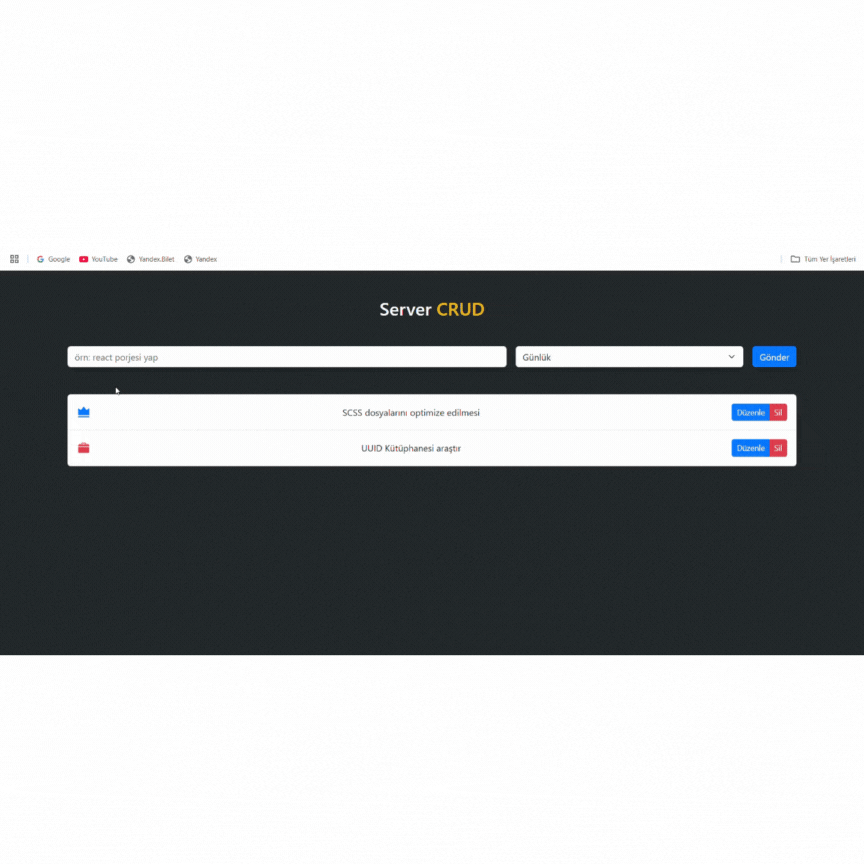

<h1>Server-Crud</h1>

Bu projemde kullanıcıların yapacakları işler ile ilgili bir planlama uygulaması yaptım kullanıcılar girevekleri verileri belirleyip günlük-iş-önemli gibi sınıflara ayırıp diledikleri gibi düzenleyip kaydedebilri silebilir değiştirebilir

<h2>Kullanılan Teknolojiler</h2>

Sayfanın genel yapısını React kullanarak yapıldı

Stillenidrmeler için genel olarak Boostrap kullanıldı

Fonksiyonların gerçekleştirtilebilmesi için React-Vite kullanıldı

<h2>Ekran Görünümü</h2>

